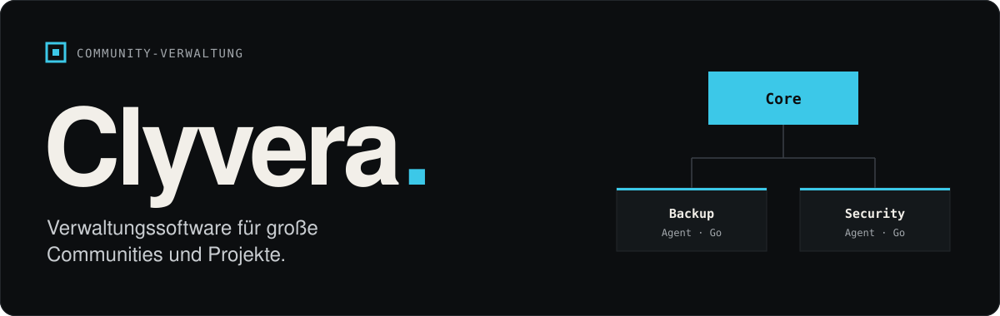

  

  <b>Clyvera</b> ist eine Verwaltungssoftware für große Communities und Projekte: 
  ein zentraler Core, an den spezialisierte Agents andocken.

  
  

 

## Bausteine

| | Baustein | Aufgabe | Status |
|---|---|---|---|
| ◆ | **Core** | Zentrale von Clyvera, steuert die angebundenen Agents | – |
| 01 | **Backup-Agent** | Sichert eingetragene Game- und andere Server automatisch oder manuell, wahlweise auf den Backup-Server oder lokal | geplant · `Go` |
| 02 | **Security-Agent** | Prüft Traffic sowie Eingaben und Befehle vom Core auf Auffälligkeiten | geplant · `Go` |

 

  Entwickelt von <a href="https://github.com/LearNivram">@LearNivram</a>

